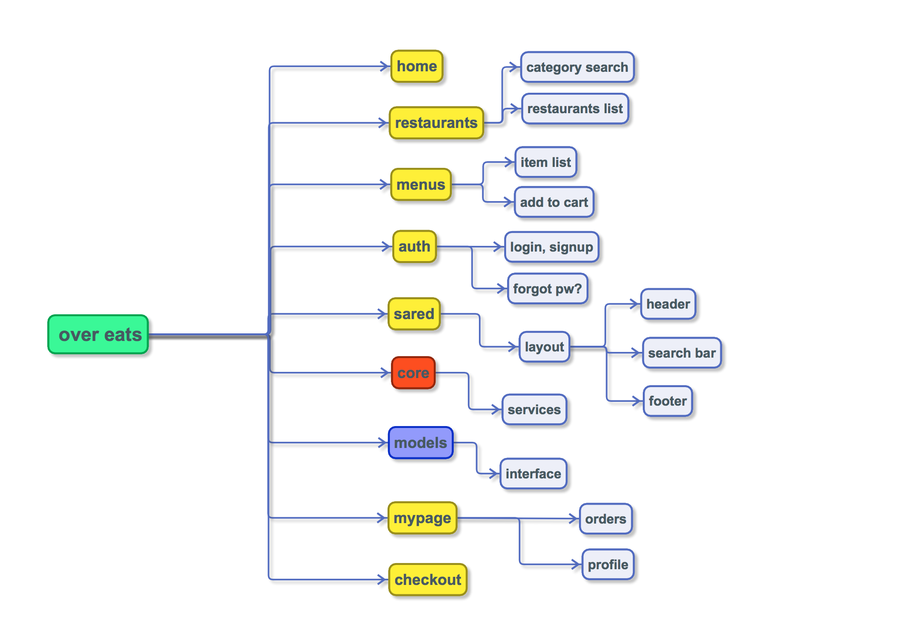

# OVER EATS

> 패스트캠퍼스 프론트앤드 스쿨 팀프로젝트

Over Eats not Uber Eats!
FDS : 오다혜 강승훈 

---

## Installing / Getting started

```shell
git clone https://github.com/yogicat/over-eats-project
cd over-eats-project/
npm install
```
- 프로젝트 포크떠주세요
- npm install로 필요한 패키지를 설치한 뒤 실행 해 주세요.


### Built With
Angular 4+


### Prerequisites

### Setting up Dev

- 항상 자신이 `develop brunch`에 있는지 확입합시다.
- 작업시 [git flow](https://danielkummer.github.io/git-flow-cheatsheet/index.ko_KR.html)를 이용해 feature로 나눠서 작업합니다.
- `git add .` 사용시 늘 주의합시다.

```shell
// 기능별로 feature를 따주세요
git flow feature start MYFEATURE
// feature 작업 완성후
git flow feature finish MYFEATURE
```


### Project Layout



- 시작 구조는 다음과 같습니다.


## Style guide

- css framework로 scss를 사용하고 공용스타일은 style.scss에 작성합니다.(버튼, 컨테이너 스타일)
- 공용변수는 _variables.scss에 작성합니다. (공용칼라, 미디어쿼리 등)

## Api Reference


## Database

- 백엔드 작업 전까지 더미데이터를 활용합니다.
- [Faker.js](https://github.com/marak/Faker.js/) 사용해 더미데이터 생성 가능.

## Licensing

## 본인의 역할

```shell

- 레스토랑 보기 페이지 작성
    서버로부터 받아오는 레스토랑 리스트의 이미지, 설명 보여주기
    스크롤 업 버튼 클릭시 상단으로 이동

- 카테고리 페이지 작성
    검색 창 클릭 시 전체리스트 표시, 검색을 통해 특정 카테고리 표시
    텍스트를 지우거나, 우측 X 버튼 클릭 시 카테고리가 사라짐

- 회원 정보 수정
    로컬 스토리지에 있는 회원 정보를 가져와서 수정 후 서버로 전송
    일정 조건에 맞지 않으면 저장버튼의 비 활성화

- 추가 주문지역 검색
    텍스트를 클릭하면, Google Geocoder를 이용해 위도, 경도를 검색 후 대상 지역 리스트를 서버로 부터 받음

```
